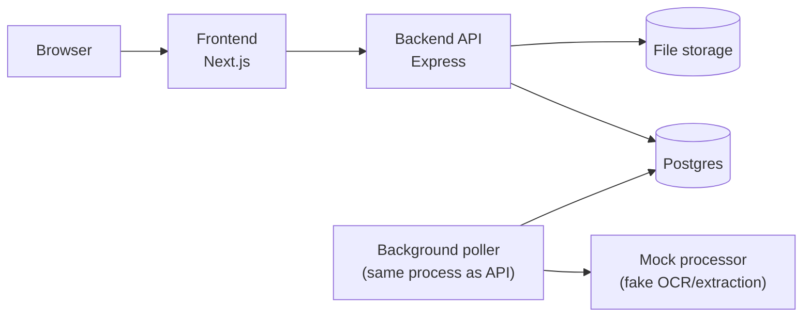
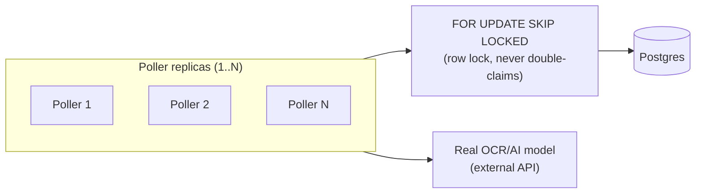

# Architecture

**Stack**: Next.js + Tailwind CSS + shadcn/ui (frontend) · Express + TypeScript
+ pino (backend) · Postgres via Prisma · npm workspaces (shared types)



One process, two jobs: the **API** handles requests, the **poller** runs in
the background picking up documents and processing them. They never call
each other directly, only through Postgres.

## Request flow

1. User uploads a PDF → API saves the file to disk, writes a `Document` row
   (`status = UPLOADED`), returns immediately.
2. Poller ticks every ~1s, picks up the oldest unprocessed document, runs it
   through the mock processor, validates the result, and updates the status
   (`PROCESSED`, `FAILED`, or `VALIDATION_FAILED`) plus a history log.
3. User polls `GET /documents/:id` (or the UI does, automatically) to see
   progress.

## Retries and crash recovery come for free

The poller always picks the same kind of document: one that's either brand
new, or has been sitting untouched for longer than the retry delay. That
single rule covers three cases at once:
- **New uploads**: untouched since the moment they arrived.
- **Retries**: untouched since the last failed attempt.
- **Crash recovery**: if the process dies mid-attempt, the document is just
  another "untouched for a while" row. The poller picks it back up the same
  way, no separate recovery logic required.

Implemented as one database query in
`backend/src/features/documents/worker/claim.ts`.

## Manual retry is a separate, human-triggered path

`POST /documents/:id/retry` is not part of the automatic mechanism above.
It's the escape hatch for a document the poller has already given up on
(`FAILED`/`VALIDATION_FAILED`). It flips the row back to `UPLOADED`, which
makes it claimable again through the exact same claim query, but it
deliberately does **not** reset `attemptCount`: a manual retry continues
the same attempt chain rather than granting a fresh budget of
`MAX_PROCESSING_ATTEMPTS`. The endpoint itself has no retry limit of its
own; the automatic cap exists to stop the poller from looping forever on a
bad file, not to limit a human's judgment call to try again.

## Scaling to multiple workers + a real OCR call



Today there's one poller (in-process with the API) and `processor.ts` returns
mocked fields. Neither needs to change to scale:
- **>1 worker**: run more replicas of the same backend image against the
  same DB. `FOR UPDATE SKIP LOCKED` already makes concurrent claiming safe:
  two pollers hitting this query at once never lock the same row, the
  second one just skips to the next available document.
- **Real OCR**: swap `runMockProcessor()` for a call to a real OCR/AI API,
  same `{ outcome, fields }` return shape. Retry/validation/history logic is
  untouched either way.

## Shared types

`/shared` is a small package of Zod schemas, imported by both `backend` and
`frontend`. Request/response shapes, status enums, and error codes are
defined once, not hand-typed twice and kept in sync manually.

- `shared/src/common/`: generic REST vocabulary any feature can reuse
  (`ErrorResponseSchema`, error codes like `NOT_FOUND`/`INTERNAL_ERROR`).
- `shared/src/documents/`: everything specific to the documents feature
  (status/type enums, document/history shapes, upload error codes like
  `INVALID_FILE_TYPE`), one schema per file under `schemas/`.

## Backend layering: controller → service → repository

Each layer has one job:
- **Controller** (`documents.controller.ts`): HTTP only. Reads the request,
  calls the service, sends the response. No business logic, no direct DB or
  filesystem calls.
- **Service** (`documents.service.ts`): the actual business logic: upload
  validation, content hashing, dedup checks, disk writes, the race-condition
  handling, response shaping. This is where the "what does an upload mean"
  rules live.
- **Repository** (`documents.repo.ts`): the only place that talks to
  Prisma/Postgres directly.

The worker (poller/claim/processor/retryPolicy) follows the same idea: it
calls the repository directly for its writes, since it's not an HTTP
concern, but it never bypasses the service's validation logic
(`validateExtraction`) when deciding whether a result is usable.

## Folder structure

Feature-based: everything about "documents", the only feature this app
has, lives together, grouped by concern rather than scattered by technical
layer. Cross-cutting infra (DB client, logger, generic UI bits) sits outside
any feature folder, since it doesn't belong to one.

```
/shared/src
  common/               exceptions.ts (error codes) + schemas/ (response envelope)
  documents/            exceptions.ts (error codes) + schemas/ (one Zod schema per file)

/backend/src
  features/documents/   routes → controller → service → repo, validation/, worker/
  db/                    Prisma client (cross-cutting)
  lib/                   logger, errors, hash, withAsyncErrorHandler (cross-cutting)

/frontend
  features/documents/  api, types, hooks/ (state + effects), components/ (presentational, props-driven)
  app/documents/        routes only, pure composition, no state/effects (Next.js requires these here)
  components/            EmptyState, Pagination: generic, reusable
  components/ui/          shadcn/ui primitives (Button, Card, Select, Table, ...)
  lib/utils.ts             cn() helper (clsx + tailwind-merge)

/tests   backend integration tests (supertest + a real Postgres)
/docs    this file
```
